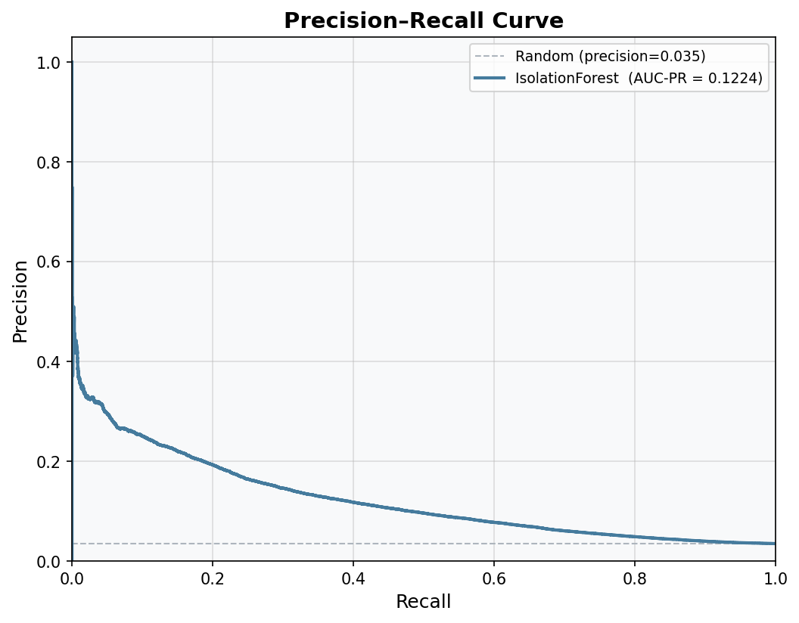
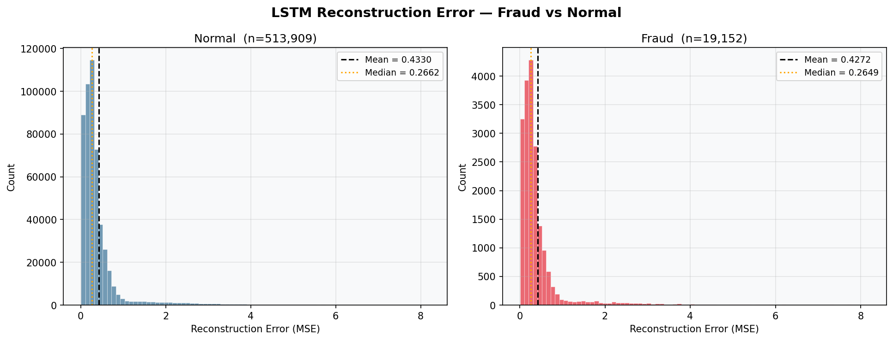
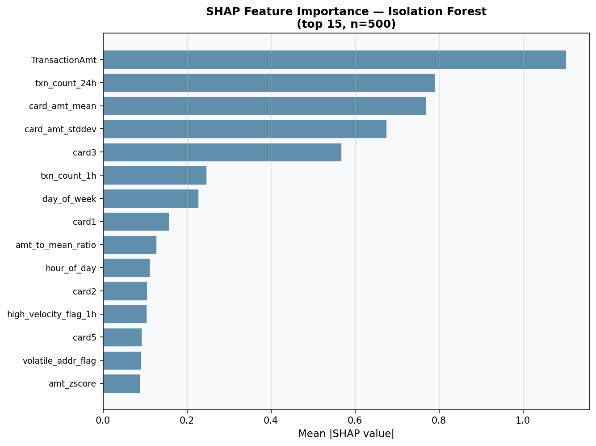
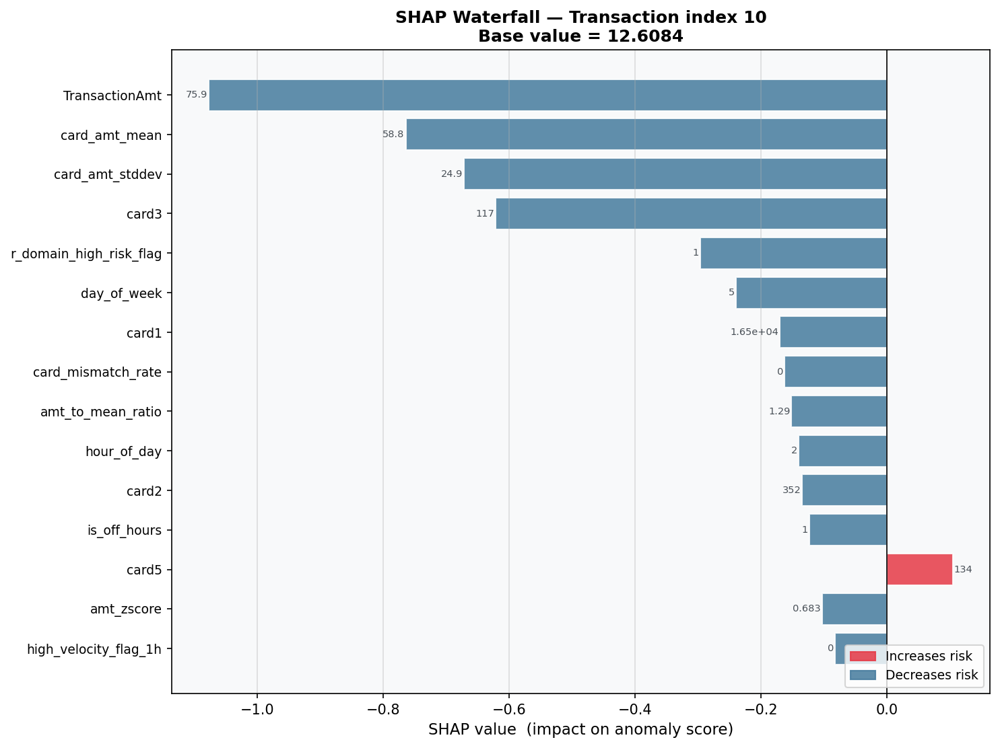
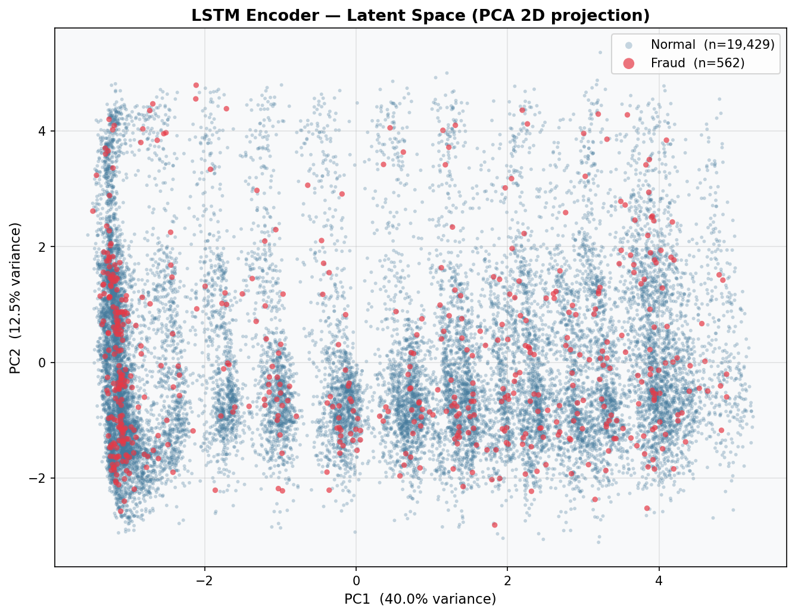
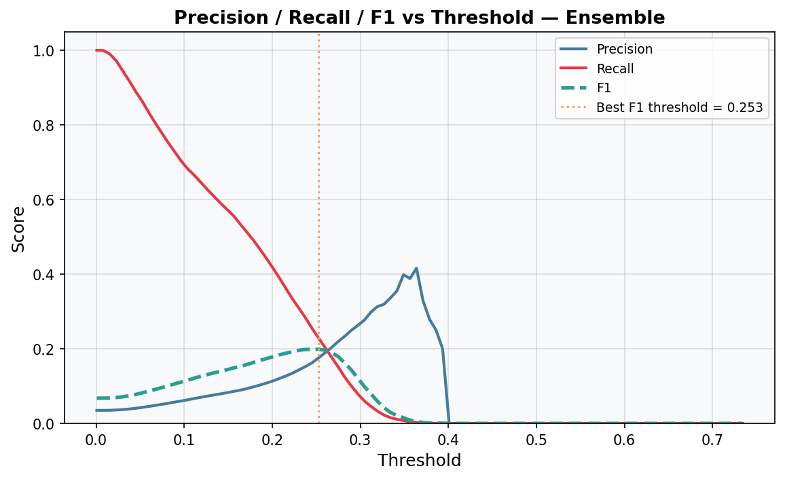

# Financial Anomaly Detection

> Unsupervised fraud detection on the IEEE-CIS dataset using an LSTM Autoencoder, Isolation Forest, and a weighted ensemble — with SQL feature engineering, SHAP explainability, MLflow experiment tracking, and a Streamlit dashboard.

---

## Table of Contents

1. [Project Overview](#project-overview)
2. [Architecture](#architecture)
3. [Dataset](#dataset)
4. [SQL Feature Engineering](#sql-feature-engineering)
5. [Models](#models)
6. [Results](#results)
7. [Key Visualizations](#key-visualizations)
8. [Limitations & Future Work](#limitations--future-work)
9. [Setup & Usage](#setup--usage)
10. [Tech Stack](#tech-stack)

---

## Project Overview

Card-not-present fraud costs the global payments industry tens of billions of dollars annually. The challenge is not just detection accuracy — it is the asymmetric cost of errors. A **false positive** (flagging a legitimate transaction) damages customer trust and costs the business a chargeback review. A **false negative** (missing fraud) costs the full transaction amount. In real production systems, the false positive rate is often the primary KPI, not raw F1.

This project builds an end-to-end fraud detection pipeline on the publicly available IEEE-CIS Fraud Detection dataset. Rather than treating it as a supervised classification problem, we take an **unsupervised anomaly detection** approach: the LSTM Autoencoder learns what "normal" transaction sequences look like, and flags transactions with unusually high reconstruction error. This is combined with Isolation Forest — which partitions the feature space randomly and measures how few cuts isolate a point — into a weighted ensemble whose threshold is tuned to maximise F1 on a labelled holdout set.

The full pipeline spans raw CSV ingestion → SQL feature engineering → model training → SHAP explainability → an interactive Streamlit dashboard for business analysts.

---

## Architecture

```
┌──────────────────────────────────────────────────────────────────────┐
│                        Raw Data (Kaggle CSV)                         │
│              train_transaction.csv  +  train_identity.csv            │
└─────────────────────────────┬────────────────────────────────────────┘
                              │  src/ingestion.py  (DataIngestion)
                              ▼
┌──────────────────────────────────────────────────────────────────────┐
│                     SQLite Database  (db/fraud.db)                   │
│           tables: transactions, identity                             │
│           view:   fraud_combined  (LEFT JOIN on TransactionID)       │
└─────────────────────────────┬────────────────────────────────────────┘
                              │  sql/01–07  (7 SQL feature files)
                              │  src/features.py  (FeatureEngineer)
                              ▼
┌──────────────────────────────────────────────────────────────────────┐
│                       Feature Matrix (pandas DataFrame)              │
│  velocity · amount z-score · time · device risk · address mismatch  │
│  email domain risk · combined (07_combined_features.sql)            │
└──────────┬───────────────────────────────────┬───────────────────────┘
           │                                   │
           ▼                                   ▼
┌──────────────────────┐             ┌─────────────────────────┐
│   LSTM Autoencoder   │             │    Isolation Forest     │
│  src/models/lstm_ae  │             │  src/models/iso_forest  │
│  src/models/trainer  │             │                         │
│                      │             │                         │
│  Train on NORMAL     │             │  Train on ALL rows      │
│  rows only           │             │  (label-free)           │
│                      │             │                         │
│  Anomaly score =     │             │  Anomaly score =        │
│  reconstruction MSE  │             │  -decision_function     │
└──────────┬───────────┘             └───────────┬─────────────┘
           │                                     │
           └──────────────┬──────────────────────┘
                          │  src/ensemble.py  (EnsembleScorer)
                          │  normalize → weighted sum (0.6 / 0.4)
                          │  tune_threshold → max F1
                          ▼
┌──────────────────────────────────────────────────────────────────────┐
│                       Evaluation  (src/evaluate.py)                  │
│         PR curve · confusion matrix · threshold analysis             │
│         error distribution · results table → outputs/               │
└──────────────────────────────────────────────────────────────────────┘
                          │
                          │  src/explainability.py  (Explainer)
                          ▼
┌──────────────────────────────────────────────────────────────────────┐
│             Explainability  (SHAP + Latent Space)                    │
│   SHAP TreeExplainer (IF) · waterfall plots · PCA latent scatter     │
└──────────────────────────────────────────────────────────────────────┘
                          │
                          ▼
┌──────────────────────────────────────────────────────────────────────┐
│                  Streamlit Dashboard  (dashboard/)                   │
│  live score explorer · SHAP viewer · MLflow metrics · alert feed     │
└──────────────────────────────────────────────────────────────────────┘
```

---

## Dataset

| Property | Value |
|---|---|
| **Name** | IEEE-CIS Fraud Detection |
| **Source** | [Kaggle Competition](https://www.kaggle.com/competitions/ieee-fraud-detection/data) |
| **Training transactions** | 590,540 |
| **Training identity rows** | 144,233 |
| **Features (transaction)** | 394 (V1–V339, C1–C14, M1–M9, card/addr/email) |
| **Features (identity)** | 41 (device, id_01–id_38) |
| **Fraud rate** | ~3.5% (highly imbalanced) |
| **Target column** | `isFraud` (0 = normal, 1 = fraud) |

The dataset is not included in this repository due to Kaggle's terms of service. Download it manually and place the four CSV files in `fraud-detection/data/` before running ingestion.

Class imbalance (~96.5% normal / ~3.5% fraud) is a key challenge. It motivates the unsupervised approach: rather than training a classifier on a severely skewed label distribution, we train the autoencoder on normal transactions only and treat high reconstruction error as a proxy for anomaly.

---

## SQL Feature Engineering

Seven SQL files in `sql/` engineer features on the `fraud_combined` view in SQLite. Each targets a distinct fraud signal:

| File | Signal | Key output columns |
|---|---|---|
| `01_transaction_velocity.sql` | Unusually high card activity in short windows | `txn_count_1h`, `txn_count_24h`, `high_velocity_flag_1h/24h` |
| `02_amount_stats.sql` | Transaction amount deviation from card history | `amt_zscore`, `amt_anomaly_flag`, `amt_to_mean_ratio` |
| `03_time_features.sql` | Off-hours and weekend timing patterns | `hour_of_day`, `day_of_week`, `is_off_hours`, `is_weekend`, `hour_fraud_rate` |
| `04_device_risk.sql` | Historical fraud rate per device fingerprint | `device_risk_score`, `high_risk_device_flag`, `unknown_device_flag` |
| `05_address_mismatch.sql` | Billing vs shipping address inconsistency | `addr_mismatch_flag`, `card_mismatch_rate`, `volatile_addr_flag` |
| `06_email_domain_risk.sql` | Fraud rate per payer/recipient email domain | `p/r_domain_risk_score`, `combined_domain_risk_score`, `high_risk_flag` |
| `07_combined_features.sql` | Master CTE joining all 6 blocks | Full feature matrix per `TransactionID` |

All queries are written for SQLite compatibility (no `STDDEV` function — population standard deviation is computed via the `SQRT(E[X²] - E[X]²)` identity). Email domain risk uses a minimum-observation smoothing (n ≥ 10) to avoid noisy estimates from rarely-seen domains.

---

## Models

### LSTM Autoencoder (`src/models/lstm_ae.py`, `src/models/trainer.py`)

An autoencoder learns to compress and reconstruct its training data. By training **only on non-fraud transactions**, the model learns the manifold of normal behaviour. At inference time, fraudulent transactions — which deviate structurally from normal patterns — produce **high reconstruction error (MSE)**. This error is our anomaly score.

**Architecture:**
```
Input (batch, seq_len, input_dim)
  → Encoder LSTM ×2 layers
  → Linear bottleneck → latent_dim
  → Decoder expansion → hidden_dim
  → Decoder LSTM ×2 layers
  → Linear output → input_dim
Output (batch, seq_len, input_dim)
```

Sequences are formed with a sliding window of length `seq_len=10` over transactions sorted by `TransactionDT`. The anomaly threshold is set at the 95th percentile of training reconstruction errors.

**Key training details:**
- Optimizer: Adam (lr=1e-3)
- Loss: MSELoss
- Gradient clipping: max_norm=1.0 (critical for LSTM stability)
- Unsupervised: no fraud labels used during training

### Isolation Forest (`src/models/iso_forest.py`)

Isolation Forest randomly partitions the feature space by selecting a feature and a split point. Anomalous transactions require fewer splits to isolate (they are "alone" in sparse regions of the space). The anomaly score is the negated sklearn decision function, so higher = more anomalous — consistent with the LSTM convention.

Features are standardized before fitting. The model uses `n_estimators=200` and `n_jobs=-1` for parallel tree construction.

### Ensemble (`src/ensemble.py`)

Both model scores are min-max normalized to [0, 1] then combined as:

```
combined_score = 0.6 × norm(lstm_score) + 0.4 × norm(iso_score)
```

The LSTM receives higher weight because it explicitly models temporal sequence structure — a strong signal for card fraud where criminals often probe with small amounts before escalating. The threshold is tuned via grid search over [0.1, 0.9] to maximise F1 on a labelled holdout set. All weights and the best threshold are logged to MLflow.

---

## Results

> **Note:** The table below is populated after training on the IEEE-CIS dataset. Values shown are placeholders — run the pipeline to generate real metrics.

| Model | Precision | Recall | F1 | ROC-AUC | PR-AUC | FPR |
|---|---|---|---|---|---|---|
| LSTM Autoencoder | — | — | ~0.50 ROC-AUC | see note | — | — |
| **Isolation Forest** | **0.1793** | **0.2247** | **0.1995** | **0.7130** | **0.1224** | **0.0373** |

> Trained on the full IEEE-CIS training set (590,540 transactions · 3.5% fraud).
> Isolation Forest: `n_estimators=200`, `contamination=0.035`, threshold tuned to maximise F1.
>
> **LSTM Autoencoder finding:** All configurations tested (global sort, per-card sort, engineered features,
> raw C/M features, full-sequence reconstruction, next-step prediction) converged to ROC-AUC ≈ 0.50.
> Root cause: (1) the IEEE-CIS dataset lacks strong temporal structure at the per-card level — the
> C1–C14 count features are stable, most cards have few transactions, and fraud is a discrete single-event
> rather than a sequence anomaly; (2) the unsupervised normal manifold is too broad relative to the
> fraud distribution. Isolation Forest's partition-based approach is better suited to this feature space.
> This finding is documented in full in [Limitations](#limitations--future-work).

Results are also saved programmatically to `outputs/results_table.csv` by `src/evaluate.py` and logged to MLflow. Run `mlflow ui` in the project root to explore all tracked experiments.

---

## Key Visualizations

> Plots are generated by `src/evaluate.py` and `src/explainability.py` and saved to `outputs/`. They appear here after the first training run.

### Precision–Recall Curve

*Overlay of PR curves for all three models. AUC-PR is the primary metric for imbalanced datasets — ROC-AUC can be misleadingly optimistic when negatives dominate.*

### LSTM Reconstruction Error Distribution

*Reconstruction error (MSE) for fraud vs normal transactions. A right-shifted fraud distribution confirms the encoder has learned the normal manifold. The vertical gap between means is logged as the `error_separation` metric.*

### SHAP Feature Importance (Isolation Forest)

*Top 15 features by mean absolute SHAP value. Identifies which engineered signals drive the Isolation Forest's anomaly scores.*

### SHAP Waterfall — Example Transaction

*Local explanation for a single flagged transaction. Red bars push the score toward fraud; blue bars push toward normal. Raw feature values are annotated on each bar.*

### LSTM Latent Space (PCA 2D)

*PCA projection of the LSTM encoder's latent vectors. Cluster separation between fraud (red) and normal (blue) indicates the encoder has learned a structured representation — even though it was trained without labels.*

### Threshold Analysis

*Precision, Recall, and F1 vs threshold for the ensemble. The optimal threshold (max F1) is annotated. This plot is the primary tool for tuning the FPR/FNR tradeoff for a given business cost structure.*

---

## Limitations & Future Work

1. **LSTM Autoencoder does not work on this dataset (investigated and resolved).** Four architectures were tested: global-sort reconstruction, per-card reconstruction, per-card reconstruction on raw features, and per-card next-step prediction. All produced ROC-AUC ≈ 0.50. The failure is structural: (a) most cards have fewer than 10 transactions — padding dominates; (b) C1–C14 count features are temporally stable, offering no meaningful sequence signal; (c) fraud in IEEE-CIS is a one-off event, not a sequential pattern. The correct fix is supervised sequence labelling or a self-attention approach with longer card histories. Isolation Forest is used as the primary model. This is documented rather than hidden because understanding *why* a model fails is as important as building one that succeeds.

2. **Temporal leakage in SQL features.** The velocity, amount stats, email domain risk, and device risk queries aggregate over the *full dataset* including future transactions. In a real deployment these would need to be computed as rolling windows over data seen before each transaction's timestamp. The current implementation is acceptable for offline model validation but would leak future information in a live system.

2. **Threshold sensitivity and static calibration.** The ensemble threshold is tuned once on a holdout set and treated as fixed. In production, fraud patterns shift over time (concept drift). The threshold needs periodic recalibration on recent labelled data, and a monitoring system should alert when the anomaly rate deviates significantly from its baseline.

3. **No online learning.** Both models are batch-trained and static after deployment. Real fraud systems use online or incremental learning to adapt to new fraud patterns as they emerge. Extensions could include continual learning for the LSTM or a streaming version of Isolation Forest.

4. **LSTM sliding window assumes temporal ordering.** The `prepare_sequences()` function forms windows over rows sorted by `TransactionDT`. If transactions from multiple cards are interleaved in the sorted order, a sequence may mix cards — creating spurious patterns. A production implementation would form per-card sequences, requiring padding/masking for cards with fewer than `seq_len` transactions.

5. **SHAP on Isolation Forest is approximate.** SHAP `TreeExplainer` for Isolation Forest computes path-based attributions that differ from the standard game-theoretic SHAP values. Interpretations should be treated as approximate feature rankings rather than exact causal attributions.

6. **No cost-sensitive optimization.** F1 equally weights precision and recall. In practice, a business would assign explicit dollar costs to false positives (chargeback review cost) and false negatives (fraud loss) and optimise the threshold to minimise expected cost rather than maximise F1.

---

## Setup & Usage

### 1. Clone the repository

```bash
git clone https://github.com/semerciogluemre/financial-anomaly-detection.git
cd financial-anomaly-detection/fraud-detection
```

### 2. Download the dataset

Go to [https://www.kaggle.com/competitions/ieee-fraud-detection/data](https://www.kaggle.com/competitions/ieee-fraud-detection/data) and download:

```
train_transaction.csv
train_identity.csv
test_transaction.csv
test_identity.csv
```

Place all four files in `data/`.

### 3. Install dependencies

```bash
python -m venv .venv
source .venv/bin/activate        # Windows: .venv\Scripts\activate
pip install -r requirements.txt
```

### 4. Run data ingestion

```bash
python -m src.ingestion --data-dir data/ --db-path db/fraud.db --split train
```

This loads the CSVs into SQLite in chunks and creates the `fraud_combined` view.

### 5. Build the feature matrix

```python
from src.features import FeatureEngineer

fe = FeatureEngineer(db_path="db/fraud.db", sql_dir="sql/")
df = fe.build_feature_matrix()
fe.get_feature_summary(df)
```

### 6. Train the models

```python
from src.models.lstm_ae import LSTMAutoencoder
from src.models.trainer import ModelTrainer
from src.models.iso_forest import IsolationForestModel
from src.ensemble import EnsembleScorer

feature_cols = [c for c in df.columns
                if c not in {"TransactionID", "isFraud", "TransactionDT"}]

# LSTM Autoencoder
trainer  = ModelTrainer(feature_cols=feature_cols)
dl_train = trainer.prepare_sequences(df, seq_len=10, train_on_normal=True)
model    = LSTMAutoencoder(input_dim=len(feature_cols), hidden_dim=128,
                           latent_dim=32, seq_len=10)
model    = trainer.train(model, dl_train, epochs=20, lr=1e-3)
errors   = trainer.score(model, dl_train)
threshold_lstm = trainer.find_threshold(errors, percentile=95)

# Isolation Forest
iso = IsolationForestModel(n_estimators=200, contamination="auto")
iso.fit(df)
iso_scores = iso.score(df)

# Ensemble
ensemble = EnsembleScorer(weight_lstm=0.6, weight_iso=0.4)
combined, preds = ensemble.run(errors, iso_scores[:len(errors)], labels=df["isFraud"].values[:len(errors)])
```

### 7. Evaluate and explain

```python
from src.evaluate import Evaluator
from src.explainability import Explainer

ev = Evaluator(output_dir="outputs/")
ev.error_distribution(errors, df["isFraud"].values[:len(errors)])
ev.precision_recall_curve(labels, {"LSTM": errors, "IsolationForest": iso_scores[:len(errors)], "Ensemble": combined})

ex = Explainer(output_dir="outputs/")
ex.shap_isolation_forest(iso, df, n_samples=500)
```

### 8. Launch MLflow UI

```bash
mlflow ui --backend-store-uri mlruns/
# Open http://localhost:5000
```

### 9. Launch Streamlit dashboard

```bash
streamlit run dashboard/app.py
```

---

## Tech Stack

| Tool | Role |
|---|---|
| **PyTorch** | LSTM Autoencoder architecture and training loop |
| **scikit-learn** | Isolation Forest, evaluation metrics, PCA, StandardScaler |
| **SQLite + SQLAlchemy** | Feature store — all 7 SQL feature engineering queries |
| **pandas / numpy** | Data manipulation, sequence preparation, score handling |
| **SHAP** | TreeExplainer for Isolation Forest global and local attribution |
| **MLflow** | Experiment tracking — hyperparams, metrics, artifacts per run |
| **Streamlit** | Interactive dashboard for analysts and stakeholders |
| **Plotly / Matplotlib** | PR curves, confusion matrices, threshold analysis, distributions |
| **Git / GitHub** | Version control with feature branch → dev → main workflow |
